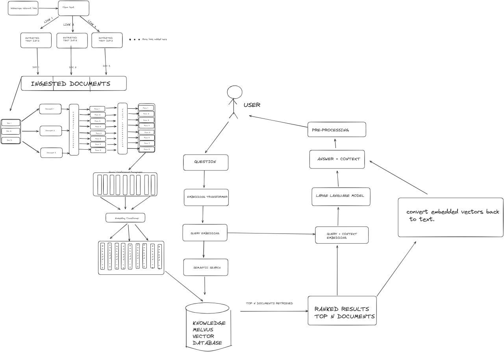

## Milestones
- [x] Detailed Project Discussion with Mentor clarifying project objectives, scope, and expectations.
- [x] Making Detailed List of Supported Models for Question Answering  considering factors such as architecture, size, and performance..
- [x] Explored multiple datasets to find the best one for evaluation of LLM Models.
- [x] Make project design documentation that encompasses project objectives, architecture, data flow, and implementation strategies.

## Screenshots / Videos 
- 

## Contributions
- [List of Supported Models](https://github.com/vanshika230/C4GT/blob/main/Data/supported_models%20(1).xlsx)
- [Explored Datasets](https://drive.google.com/drive/folders/19DlVyZLz8iClaoVqUyldW7TI7IOTcSTn?usp=sharing)

## Learnings
- Familiarized myself with the latest advancements in the field of Question Answering (QA) and Large Language Models (LLMs), gaining insights into their applications and potential use cases.
- Read Hugging Face Documentation in depth for working with query embeddings and LLM Models. 
- Experimented with transformers and pytorch to find the best method to start coding an Evaluation Script. 
- Detailed project design documentations is very important for smooth planning. 
- Having clarity on project milestones to be achieved before coding is very crucial. 
