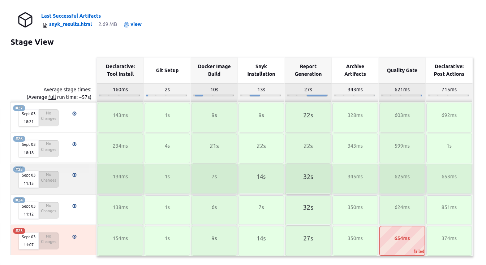

## Milestones

- [x] Verifying the scan results
- [x] Fix HTML report styling issues - easier to interpret the results
- [x] Applying Quality gates - for pipeline to Pass/Fail the build based on scan results

## Screenshots / Videos




## Contributions

## Learnings

1. For HTML Publisher Jenkins plugin, CSS styling is disabled by default.
   CSS is stripped out because of the Content Security Policy in Jenkins. (https://wiki.jenkins-ci.org/display/JENKINS/Configuring+Content+Security+Policy)

The default rule is set to:

    sandbox; default-src 'none'; img-src 'self'; style-src 'self';

This rule set results in the following:

    1. No JavaScript allowed at all
    2. No plugins (object/embed) allowed
    3. No inline CSS, or CSS from other sites allowed
    4. No images from other sites allowed
    5. No frames allowed
    6. No web fonts allowed
    7. No XHR/AJAX allowed, etc.

To relax this rule, we have to go to:

Manage Jenkins -> Manage Nodes -> Click settings(gear icon) -> click Script console on left and type in the following command:

    System.setProperty("hudson.model.DirectoryBrowserSupport.CSP", "")

and Press Run. If we see the output as 'Result:' below "Result" header then the protection disabled. Re-Run build and the new HTML files archived will have the CSS enabled.

2. Handling JSON in command line using the ```jq``` tool.
